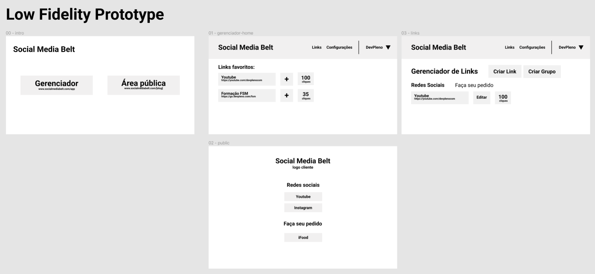

# SaaS (Software as a Service) | Social Media Belt

Desenvolvido durante o [D30](https://www.youtube.com/c/DevPlenoD30) promovido pelo DevPleno em fev/2022.

 

## Sobre

Um software de gerenciamento de links compartilhados.

### Objetivos:

- Must have:
  - Gerenciar os links
  - Agrupá-los
  - Gerenciar ou gerar as UTMs
  - Página pública com todos os links (selecionados)
  - Encurtar um link

- Nice to have:
  - Domínio próprio
  - Analytics: quantos clicks, de onde vieram...
  - Link nativo: abrir o app direto (one link...)
  - p2p ou banco de imagens (poder enviar do PC para o celular)

  vai.devpleno.co/fsm-insta -> go.devpleno.com/formacaofsm?utm=lalala

### Dados:

- Accounts(tenant)
  - id, slug (devpleno), plan, name, image (logo)
- AccountUser:
  - account_id, user_id, role
- Subscription:
  - TBD (_to be defined_)
- User:
  - id, email, name
- Link
  - id, account_id, name, public_name, destination, slug, show_on_public
- UTMs:
  - utm_source, utm_media, ...
- LinkGroup:
  - id, account_id, name (n:m - Link), show_on_public
- ShareableLink:
  - id, account_id, link_id, utm_id, analytics

### Regras (uso justo, e que favoreça o premium):
- tentar limitar o número de sign-ins
- limitar o número de domínios de destino
  - somente para: devpleno.com
- somente permitir algumas funcionalidades em contas premium

 

## Planejamento das telas

Desenvolvimento de um protótipo de baixa fidelidade no [Figma](https://www.figma.com/file/HKXZoDqn9z9OR7PjmQaOsB/Untitled?node-id=0%3A1)

 

## Linguagens/tecnologias utilizadas

- Typescript
- [React](https://pt-br.reactjs.org/)
- [Next](https://nextjs.org/) (projeto criado com `npx create-next-app@latest --ts`)
- [Tailwindcss](https://tailwindcss.com/docs/guides/nextjs) (inclusive usamos um template do [Tail-kit](https://www.tailwind-kit.com/templates/datadashboard), adaptando o [html para jsx](https://magic.reactjs.net/htmltojsx.htm) )

 

## Como rodar o projeto?
